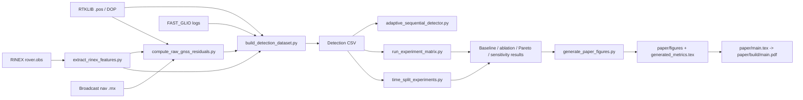

# 项目架构与使用文档

本文档面向后续开发、实验复现和论文投稿整理。项目当前同时包含两条主线：

1. C++ 飞行仿真与可视化平台：用于复现 GPS 欺骗攻击、飞控闭环、导航融合、检测器触发和 UI 展示。
2. GNSS 欺骗检测论文平台：用于把 RTKLIB、RINEX 原始观测、FAST_GLIO 日志、raw residual、RAIM baseline、EA-SGLRT 主算法、baseline 对比、实验矩阵和 LaTeX 论文打通。

当前仓库已经不是单纯仿真 demo，而是一个“仿真 + 真实数据适配 + 原始观测残差 + 多 baseline + 论文生成”的完整研究工程雏形。论文投稿前仍需要更多真实路线和真实或回放欺骗数据，但工程链路已经可以复现实验、生成图表并编译论文。

## 1. 目录结构

```text
cpp_flight_sim/
├── CMakeLists.txt
├── README.md
├── include/                         # C++ 公共头文件
├── src/                             # C++ 仿真、控制、导航、检测、UI 入口
├── tests/                           # C++ 与 Python smoke test 的 CTest 入口
├── tools/                           # 数据适配、RINEX、raw residual、实验矩阵、论文图
├── datasets/
│   └── routes.yaml                  # 多 route 实验注册表
├── scenarios/                       # 自定义仿真 scenario 和 waypoint 示例
├── docs/                            # 项目文档、论文平台说明、文献综述
├── paper/
│   ├── main.tex                     # 当前论文 LaTeX 主文件
│   ├── references.bib
│   ├── generated_metrics.tex        # 实验脚本自动生成的指标宏
│   ├── figures/                     # 论文图
│   └── build/main.pdf               # 编译后的论文 PDF
├── third_party/                     # Dear ImGui、本地 Python 依赖等
└── build/                           # CMake 和实验输出目录，不作为主要源码维护
```

## 2. 总体数据流



核心思想是把多源数据统一到同一个 detection CSV，再围绕这个 CSV 做算法、评测和论文复现。

## 3. C++ 仿真平台

### 3.1 主要模块

| 模块 | 文件 | 作用 |
| --- | --- | --- |
| 仿真主循环 | `src/simulator.cpp`, `src/main.cpp` | 推进动力学、传感器、导航、控制、检测和日志输出 |
| 动力学 | `src/dynamics.cpp` | 四旋翼刚体平移和转动积分 |
| 轨迹 | `src/trajectory.cpp` | hover、figure8、waypoint smoothstep 轨迹 |
| 控制 | `src/controller.cpp` | 位置/速度/姿态级联控制 |
| 传感器 | `src/sensors.cpp`, `src/gnss.cpp` | IMU、GPS、气压计、UWB、光流、磁罗盘、伪距模拟 |
| 导航融合 | `src/navigation.cpp` | 惯性预测、GPS/UWB/光流/气压计/磁罗盘更新 |
| 欺骗检测 | `src/detector.cpp` | residual、GLRT、GPS 信任状态 |
| 飞行状态机 | `src/flight_state_machine.cpp` | takeoff、mission、GPS suspect/rejected/reacquire、landing |
| 可视化 | `src/visualizer.cpp`, `src/imgui_app.cpp` | HTML dashboard 和可选 Dear ImGui UI |

### 3.2 构建

```bash
cd /Users/wangzhibo/Desktop/博士研究/simulink2/cpp_flight_sim
cmake -S . -B build
cmake --build build
```

### 3.3 运行默认仿真

```bash
./build/f7_sim
```

默认输出：

```text
simulation.csv
dashboard.html
```

建议显式写到 `build/`：

```bash
./build/f7_sim \
  --output build/final_simulation.csv \
  --html build/final_dashboard.html
```

打开 HTML：

```bash
open build/final_dashboard.html
```

### 3.4 自定义仿真路线

内置轨迹：

```bash
./build/f7_sim --trajectory hover --duration 20 --output build/hover.csv
./build/f7_sim --trajectory figure8 --duration 50 --output build/figure8.csv
```

waypoint CSV 格式：

```csv
time_s,x,y,z,yaw_rad
0,0,0,0,0
4,0,0,1.8,0
10,2.5,0,1.8,0
16,2.5,2.5,2.0,1.5707963268
22,0,2.5,1.8,3.1415926536
28,0,0,1.8,-1.5707963268
```

运行 waypoint：

```bash
./build/f7_sim \
  --trajectory-file scenarios/custom_square.csv \
  --duration 42 \
  --output build/custom_square.csv \
  --html build/custom_square.html
```

scenario 文件适合复现实验：

```bash
./build/f7_sim --print-scenario-template
./build/f7_sim --scenario scenarios/custom_square.scenario
```

常用 scenario key：

```text
duration_s, dt_s, output_csv, output_html, write_html
trajectory, trajectory_file
attack_start_s, attack_end_s, attack_offset_m, pseudorange_delay_m, attack_ramp_s
glrt_threshold, glrt_false_alarm_rate, pseudorange_noise_sigma_m, gps_residual_threshold_m
consecutive_samples, glrt_warmup_samples
enable_uwb, enable_optical_flow, enable_magnetometer
reference_lat_deg, reference_lon_deg, reference_alt_m
```

### 3.5 C++ 输出 CSV 字段

仿真 CSV 包含：

- true state、navigation estimate、GPS measurement、trajectory reference；
- attack flag、detector flag、GPS trust/rejection state；
- residual norm、pseudorange RMS、GLRT statistic、threshold、trigger state；
- UWB、optical-flow、barometer、magnetometer 的观测和有效标志；
- flight mode、failsafe/reacquire 状态；
- control outputs。

该 CSV 可以被 HTML dashboard、Rerun viewer、后处理脚本或 MATLAB/Python 读取。

## 4. 可视化入口

### 4.1 HTML dashboard

`f7_sim` 可以直接生成无依赖 HTML：

```bash
./build/f7_sim --output build/simulation.csv --html build/dashboard.html
open build/dashboard.html
```

### 4.2 Dear ImGui UI

`f7_imgui` 是可选目标。CMake 只有在下面依赖存在时才会构建：

```text
third_party/imgui/imgui.cpp
third_party/imgui/backends/imgui_impl_glfw.cpp
GLFW
OpenGL
```

构建并运行：

```bash
cmake -S . -B build
cmake --build build
./build/f7_sim --output build/final_simulation.csv --html build/final_dashboard.html
open -n build/f7_imgui.app --args "$(pwd)/build/final_simulation.csv"
```

如果没有构建成功，CMake 会提示：

```text
f7_imgui disabled: place Dear ImGui sources in third_party/imgui and install GLFW
```

### 4.3 Rerun 3D/time-series dashboard

安装本地依赖：

```bash
python -m pip install --target third_party/python_deps rerun-sdk
python -m pip install --target third_party/python_deps --upgrade numpy==1.26.4
```

运行：

```bash
cmake --build build --target rerun_view
```

或直接打开某个 CSV：

```bash
python tools/rerun_viewer.py build/final_simulation.csv
```

保存离线 `.rrd`：

```bash
cmake --build build --target rerun_record
python tools/rerun_viewer.py build/final_simulation.csv \
  --save build/final_simulation.rrd \
  --no-spawn
```

论文攻击实验的 Rerun 入口使用 RTKLIB 完整时间轴，不再只显示 FAST_GLIO loose 的 217 个同步样本：

```bash
cmake --build build --target paper_rerun_record
python tools/rerun_paper_attack_viewer.py \
  build/paper_platform/full_data_attack_full_timeline/full_data_attack_full_timeline_detection.csv \
  --timeline build/paper_platform/full_data_attack_full_timeline/full_data_attack_full_timeline_adaptive_seq.csv \
  --satellite-features build/paper_platform/rinex_rover_attack/full_data_rover_attack_satellite_features.csv \
  --attack-summary build/paper_platform/rinex_rover_attack/full_data_rover_attack_attack_summary.json \
  --save build/paper_platform/paper_attack_visualization.rrd \
  --no-spawn
```

该 `.rrd` 会显示完整 RTK 轨迹、攻击注入开始/结束、观测级 pseudorange 注入、固定分数首次报警、EA-SGLRT 首次报警、score/CUSUM/confidence 曲线和被攻击卫星 bias 曲线；事件文本会区分攻击窗口内检测和攻击窗口外报警。默认论文评估 CSV 仍以 FAST_GLIO 可同步窗口为准；完整可视化目标通过 `--base-timeline rtk` 覆盖整个 RTKLIB route。

## 5. 真实数据和论文平台

### 5.1 当前默认数据路径

CMake 默认寻找：

```text
../full_data/gnss/rtklib.pos
../full_data/gnss/dop.txt
../full_data/gnss/rover.obs
../full_data/gnss/BRDM00DLR_S_20240290000_01D_MN.rnx
/Users/wangzhibo/Desktop/FAST_GLIO/FAST_LIO/Log/gnss_loose_diag.csv
/Users/wangzhibo/Desktop/FAST_GLIO/FAST_LIO/Log/gnss_raw_update_log.csv
/Users/wangzhibo/Desktop/FAST_GLIO/FAST_LIO/Log/gnss_tight_pose.csv
```

FAST_GLIO 日志目录可以用环境变量覆盖：

```bash
export FAST_GLIO_LOG_DIR=/path/to/FAST_GLIO/FAST_LIO/Log
cmake -S . -B build
```

### 5.2 从 RTKLIB route 生成仿真路线

```bash
python tools/rtklib_dataset_adapter.py \
  --pos ../full_data/gnss/rtklib.pos \
  --dop ../full_data/gnss/dop.txt \
  --name full_data_rtklib \
  --output-dir build/datasets/full_data_rtklib
```

输出：

```text
build/datasets/full_data_rtklib/full_data_rtklib_waypoints.csv
build/datasets/full_data_rtklib/full_data_rtklib.scenario
build/datasets/full_data_rtklib/full_data_rtklib_replay.csv
build/datasets/full_data_rtklib/full_data_rtklib_summary.json
```

运行适配后的路线：

```bash
./build/f7_sim --scenario build/datasets/full_data_rtklib/full_data_rtklib.scenario
```

CMake 快捷入口：

```bash
cmake --build build --target adapt_full_data
cmake --build build --target simulate_full_data
```

### 5.3 提取 RINEX 原始观测特征

```bash
python tools/extract_rinex_features.py \
  --obs ../full_data/gnss/rover.obs \
  --name full_data_rover \
  --output-dir build/paper_platform/rinex_rover
```

输出：

```text
full_data_rover_satellite_features.csv
full_data_rover_epoch_summary.csv
full_data_rover_rinex_summary.json
```

### 5.4 计算 raw pseudorange residual 和 RAIM baseline

GPS 默认版本：

```bash
python tools/compute_raw_gnss_residuals.py \
  --obs ../full_data/gnss/rover.obs \
  --nav ../full_data/gnss/BRDM00DLR_S_20240290000_01D_MN.rnx \
  --rtklib-pos ../full_data/gnss/rtklib.pos \
  --systems G \
  --name full_data_raw_clean \
  --output-dir build/paper_platform/raw_gnss_clean
```

多星座短样本 smoke：

```bash
python tools/compute_raw_gnss_residuals.py \
  --obs ../full_data/gnss/rover.obs \
  --nav ../full_data/gnss/BRDM00DLR_S_20240290000_01D_MN.rnx \
  --rtklib-pos ../full_data/gnss/rtklib.pos \
  --systems G,E,C \
  --max-epochs 80 \
  --name multi_gnss_smoke \
  --output-dir build/paper_platform/multi_gnss_smoke
```

说明：

- GPS/Galileo broadcast residual 已在当前数据短样本验证；
- BeiDou 已接入 Kepler 传播和多 clock 状态框架，但 BDS 专用修正仍标为 experimental；
- Doppler/TDCP 字段链路已存在，若数据缺失会输出 count 为 0 或空值，不会中断平台。

### 5.5 观测级攻击注入

```bash
python tools/inject_observation_attack.py \
  --satellite-features build/paper_platform/rinex_rover/full_data_rover_satellite_features.csv \
  --name full_data_rover_attack \
  --output-dir build/paper_platform/rinex_rover_attack \
  --relative-origin-csv /Users/wangzhibo/Desktop/FAST_GLIO/FAST_LIO/Log/gnss_loose_diag.csv \
  --attack-window +180:+260 \
  --common-delay-m 18.0 \
  --per-satellite-bias-m 180.0 \
  --satellite-mode list \
  --satellites G02 \
  --systems G
```

然后重算 raw residual：

```bash
python tools/compute_raw_gnss_residuals.py \
  --satellite-features build/paper_platform/rinex_rover_attack/full_data_rover_attack_satellite_features.csv \
  --nav ../full_data/gnss/BRDM00DLR_S_20240290000_01D_MN.rnx \
  --rtklib-pos ../full_data/gnss/rtklib.pos \
  --systems G \
  --name full_data_raw_attack \
  --output-dir build/paper_platform/raw_gnss_attack
```

### 5.6 构建 detection CSV

clean 数据集：

```bash
python tools/build_detection_dataset.py \
  --rtklib-pos ../full_data/gnss/rtklib.pos \
  --dop ../full_data/gnss/dop.txt \
  --loose /Users/wangzhibo/Desktop/FAST_GLIO/FAST_LIO/Log/gnss_loose_diag.csv \
  --raw /Users/wangzhibo/Desktop/FAST_GLIO/FAST_LIO/Log/gnss_raw_update_log.csv \
  --tight /Users/wangzhibo/Desktop/FAST_GLIO/FAST_LIO/Log/gnss_tight_pose.csv \
  --rinex-summary build/paper_platform/rinex_rover/full_data_rover_epoch_summary.csv \
  --raw-residual-summary build/paper_platform/raw_gnss_clean/full_data_raw_clean_raw_epoch_residuals.csv \
  --name full_data_clean \
  --output-dir build/paper_platform/full_data_clean
```

带合成攻击的数据集：

```bash
python tools/build_detection_dataset.py \
  --rtklib-pos ../full_data/gnss/rtklib.pos \
  --dop ../full_data/gnss/dop.txt \
  --loose /Users/wangzhibo/Desktop/FAST_GLIO/FAST_LIO/Log/gnss_loose_diag.csv \
  --raw /Users/wangzhibo/Desktop/FAST_GLIO/FAST_LIO/Log/gnss_raw_update_log.csv \
  --tight /Users/wangzhibo/Desktop/FAST_GLIO/FAST_LIO/Log/gnss_tight_pose.csv \
  --rinex-summary build/paper_platform/rinex_rover/full_data_rover_epoch_summary.csv \
  --raw-residual-summary build/paper_platform/raw_gnss_attack/full_data_raw_attack_raw_epoch_residuals.csv \
  --name full_data_attack \
  --output-dir build/paper_platform/full_data_attack \
  --attack-window +180:+260 \
  --attack-offset 8.0,-3.0,0.5 \
  --pseudorange-delay 18.0
```

### 5.7 评测 detection CSV

```bash
python tools/evaluate_detection.py \
  build/paper_platform/full_data_attack/full_data_attack_detection.csv \
  --output-json build/paper_platform/full_data_attack/full_data_attack_metrics.json \
  --output-md build/paper_platform/full_data_attack/full_data_attack_metrics.md
```

## 6. 主算法和 baseline

主算法在：

```text
tools/adaptive_sequential_detector.py
```

当前 detector 列表：

```text
raim_only
robust_raim
ekf_innovation
pseudorange_glrt_only
lio_residual_only
fixed_fused
fixed_cusum_fused
adaptive_fused
adaptive_seq_full
adaptive_seq_no_raw
adaptive_seq_no_lio
adaptive_seq_no_env
adaptive_seq_no_cusum
```

单独运行：

```bash
python tools/adaptive_sequential_detector.py \
  build/paper_platform/full_data_clean/full_data_clean_detection.csv \
  --output-csv build/paper_platform/adaptive_detector_outputs.csv \
  --metrics-json build/paper_platform/adaptive_detector_metrics.json \
  --metrics-md build/paper_platform/adaptive_detector_metrics.md
```

EA-SGLRT 使用：

- raw GNSS residual；
- receiver pseudorange RMS/max residual；
- LiDAR-GNSS residual 和 Mahalanobis；
- Doppler/TDCP residual；
- C/N0、DOP、RTK ratio、satellite count、healthy PR count 等环境质量；
- CUSUM-style sequential confirmation；
- confidence 和 attack type 输出。

当前论文叙述重点不是让 EA-SGLRT 取得最高单点 F1，而是在低误报工作点下保持可用检测性能。最新实现从“残差加权累积”改为“raw pseudorange/receiver diagnostic/LIO-GNSS 多证据一致性门控 + 环境惩罚 + CUSUM”，并使用 clean/degraded 非攻击数据的 6 alarms/min 预算选择最敏感工作点；当前 mean false alarm 约 5.94/min，相对 fixed fused 降低约 66.7%。代价是 recall/F1 下降，因此应作为 F1/false-alarm Pareto frontier 和 integrity trade-off 来写。

## 7. 实验矩阵

### 7.1 单 route 主实验

```bash
python tools/run_experiment_matrix.py \
  --base-csv build/paper_platform/full_data_clean/full_data_clean_detection.csv \
  --output-dir build/paper_platform/adaptive_experiments
```

默认矩阵：

- clean real data；
- degraded non-attack data；
- synthetic spoofing；
- attack strength: 1, 2, 5, 10 m；
- ramp: 1, 5, 20, 60 s；
- attack type: position_bias, pseudorange_delay, single_sat_outlier, coordinated_spoof, slow_drift；
- sensitivity grid；
- F1/false-alarm Pareto analysis；
- `FA/min <= 6` 约束下的 operating point selection。

主要输出：

```text
matrix_results.csv
detector_summary.csv
scenario_summary.csv
attack_type_summary.csv
attack_strength_summary.csv
attack_ramp_summary.csv
environment_summary.csv
pareto_summary.csv
sensitivity_summary.csv
attack_classification_summary.csv
adaptive_timeline.csv
experiment_summary.json
experiment_summary.md
```

### 7.2 route split 实验

两个或多个 route 时使用：

```bash
python tools/route_split_experiments.py \
  --route route_a=build/paper_platform/full_data_clean/full_data_clean_detection.csv \
  --route route_b=/path/to/another_route_detection.csv \
  --train-routes route_a \
  --test-routes route_b \
  --output-dir build/paper_platform/route_split_experiments
```

输出：

```text
tuning_summary.csv
train_results.csv
test_results.csv
detector_summary.csv
route_split_summary.json
route_split_summary.md
```

说明：

- `train-routes` 用于调参；
- `test-routes` 用于报告泛化性能；
- optional ML baseline 默认启用；
- 只有单 route 时只能作为 smoke/demo，不适合写成最终投稿结论。

### 7.3 单 route 时间留出实验

如果目前只有一条真实 route，可以把前半段用于阈值校准，把剩余数据作为 held-out test。这样仍然不如多 route 泛化强，但比在同一时间段上调参和报告更合理。

```bash
python tools/time_split_experiments.py \
  --base-csv build/paper_platform/full_data_clean/full_data_clean_detection.csv \
  --output-dir build/paper_platform/time_split_experiments \
  --train-fraction 0.60 \
  --operating-fa-limit 6.0
```

默认逻辑：

- 按 `time_s` 排序；
- 前 60% 时间跨度作为 `calibration`；
- 后 40% 作为 `heldout_test`；
- 每个 segment 内重新把 `time_s` 归零，因此 `--attack-window +20:+260` 表示相对当前 segment 的攻击窗口；
- 只用 calibration 段 clean/degraded 非攻击数据选择 EA-SGLRT 参数；
- heldout_test 段只用于最终 precision、recall、F1、PMD、FA/min 和 latency 报告。

输出：

```text
calibration_segment.csv
heldout_test_segment.csv
tuning_summary.csv
train_results.csv
test_results.csv
detector_summary.csv
time_split_summary.json
time_split_summary.md
```

CMake 快捷入口：

```bash
cmake --build build --target time_split_experiments
```

当前 full_data 默认结果显示：EA-SGLRT 在 held-out 段可以把误报压到 6 alarms/min 预算内，但 recall 仍偏低。论文中应把这个结果写成低误报与漏检率之间的 trade-off，而不是写成“已经完全可发表泛化”。

### 7.4 配置化 route registry

编辑：

```text
datasets/routes.yaml
```

示例结构：

```yaml
routes:
  - name: full_data
    environment: mixed_real_route
    detection_csv: build/paper_platform/full_data_clean/full_data_clean_detection.csv

splits:
  train:
    - full_data
  test:
    - full_data

experiment:
  strengths_m: [2, 10]
  ramps_s: [1, 20]
  attack_types: [position_bias, coordinated_spoof]
```

运行：

```bash
python tools/run_configured_routes.py \
  --config datasets/routes.yaml \
  --output-dir build/paper_platform/configured_route_experiments
```

## 8. CMake 常用目标

```bash
cmake --build build --target f7_sim
cmake --build build --target adapt_full_data
cmake --build build --target simulate_full_data
cmake --build build --target rinex_features
cmake --build build --target raw_gnss_residuals
cmake --build build --target raw_observation_attack
cmake --build build --target raw_gnss_residuals_attack
cmake --build build --target paper_dataset
cmake --build build --target paper_dataset_attack
cmake --build build --target paper_dataset_attack_full_timeline
cmake --build build --target paper_adaptive_attack_full_timeline
cmake --build build --target paper_eval_clean
cmake --build build --target paper_eval_attack
cmake --build build --target paper_pipeline
cmake --build build --target adaptive_experiments
cmake --build build --target time_split_experiments
cmake --build build --target route_split_experiments
cmake --build build --target configured_route_experiments
cmake --build build --target paper_figures
cmake --build build --target paper_pdf
cmake --build build --target rerun_view
cmake --build build --target rerun_record
cmake --build build --target paper_rerun_record
cmake --build build --target paper_rerun_view
```

最常用的一键复现论文：

```bash
cmake -S . -B build
cmake --build build --target paper_pdf
```

该目标会生成：

```text
build/paper_platform/...
paper/figures/*.png
paper/generated_metrics.tex
paper/build/main.pdf
```

## 9. 论文文件

```text
paper/main.tex
paper/references.bib
paper/generated_metrics.tex
paper/figures/
paper/build/main.pdf
```

当前论文包含：

- Introduction；
- Related Work；
- System and Features；
- Method；
- Experiments；
- Attack Factor Study；
- Benign Degradation and Ablation；
- Parameter Sensitivity；
- Discussion；
- Limitations；
- Conclusion。

论文图由 `tools/generate_paper_figures.py` 生成，包括：

```text
system_architecture.png
trajectory_quality.png
raw_observation_summary.png
raw_raim_timeline.png
adaptive_baseline_comparison.png
false_alarm_pareto.png
attack_matrix_heatmap.png
attack_type_breakdown.png
environment_false_alarm.png
ablation_comparison.png
parameter_sensitivity.png
adaptive_cusum_timeline.png
visualization_experiment.png
```

## 10. 测试和验证

构建后运行：

```bash
ctest --test-dir build --output-on-failure
```

当前测试覆盖：

- C++ 飞行仿真基础行为；
- paper pipeline smoke；
- RINEX feature extraction smoke；
- raw residual smoke；
- adaptive detector smoke；
- route split smoke；
- time split smoke；
- configured routes smoke。

建议每次修改核心算法或数据脚本后至少运行：

```bash
PYTHONPYCACHEPREFIX=build/pycache python3 -m py_compile tools/run_experiment_matrix.py tools/time_split_experiments.py tools/generate_paper_figures.py
ctest --test-dir build --output-on-failure
cmake --build build --target paper_pdf
```

## 11. 如何适配自己的新数据集

### 11.1 准备数据

最理想的数据包括：

```text
gnss/rtklib.pos
gnss/dop.txt
gnss/rover.obs
gnss/broadcast_nav.rnx
FAST_GLIO/Log/gnss_loose_diag.csv
FAST_GLIO/Log/gnss_raw_update_log.csv
FAST_GLIO/Log/gnss_tight_pose.csv
```

最小可运行路线：

- 有 `rtklib.pos` 可以生成仿真路线；
- 有 FAST_GLIO loose/raw/tight 可以生成 detection CSV；
- 有 RINEX obs/nav 可以计算 raw residual 和 RAIM baseline。

### 11.2 生成 route detection CSV

对每条 route 独立运行：

```bash
python tools/extract_rinex_features.py \
  --obs /path/to/route/rover.obs \
  --name route_name_rover \
  --output-dir build/paper_platform/routes/route_name/rinex

python tools/compute_raw_gnss_residuals.py \
  --obs /path/to/route/rover.obs \
  --nav /path/to/route/broadcast_nav.rnx \
  --rtklib-pos /path/to/route/rtklib.pos \
  --systems G \
  --name route_name_raw_clean \
  --output-dir build/paper_platform/routes/route_name/raw_gnss

python tools/build_detection_dataset.py \
  --rtklib-pos /path/to/route/rtklib.pos \
  --dop /path/to/route/dop.txt \
  --loose /path/to/FAST_GLIO/Log/gnss_loose_diag.csv \
  --raw /path/to/FAST_GLIO/Log/gnss_raw_update_log.csv \
  --tight /path/to/FAST_GLIO/Log/gnss_tight_pose.csv \
  --rinex-summary build/paper_platform/routes/route_name/rinex/route_name_rover_epoch_summary.csv \
  --raw-residual-summary build/paper_platform/routes/route_name/raw_gnss/route_name_raw_clean_raw_epoch_residuals.csv \
  --name route_name_clean \
  --output-dir build/paper_platform/routes/route_name/detection
```

### 11.3 注册到 route registry

把 route 加到 `datasets/routes.yaml`：

```yaml
routes:
  - name: route_a
    environment: open_sky
    detection_csv: build/paper_platform/routes/route_a/detection/route_a_clean_detection.csv
  - name: route_b
    environment: urban_canyon
    detection_csv: build/paper_platform/routes/route_b/detection/route_b_clean_detection.csv

splits:
  train:
    - route_a
  test:
    - route_b
```

运行：

```bash
python tools/run_configured_routes.py \
  --config datasets/routes.yaml \
  --output-dir build/paper_platform/configured_route_experiments
```

### 11.4 投稿级数据建议

为了支撑 GPS Solutions 级别投稿，建议至少准备：

- open-sky clean route；
- urban/degraded non-attack route；
- tree canopy 或遮挡 route；
- replay 或真实 spoofing route；
- 至少一个 train route 和一个完全 held-out test route；
- 每条 route 明确记录接收机型号、天线、采样率、坐标基准、时间基准、环境类型。

## 12. 当前已知局限

1. 当前强结论仍主要来自单条真实路线和合成攻击矩阵；temporal held-out 已补上，但多 route held-out 仍需要更多真实数据。
2. 真实 RF spoofing 或 replay spoofing 数据尚不足，synthetic observation-level attack 需要更多外部验证。
3. BeiDou residual 框架已接入，但 BDS 专用修正仍需完善。
4. Doppler/TDCP 框架已接入，但当前数据中 Doppler 可能缺失，无法充分体现该 cue。
5. EA-SGLRT 当前是低误报工作点，F1 不是所有 baseline 中最高。论文需要明确以 false-alarm constrained detection 为贡献，而不是宣称绝对最高 F1。
6. 论文 PDF 已能编译，但投稿前仍需扩充实验、图表排版、统计显著性和真实数据说明。

## 13. 推荐开发流程

日常改代码：

```bash
cmake -S . -B build
cmake --build build
ctest --test-dir build --output-on-failure
```

改数据脚本或检测算法：

```bash
PYTHONPYCACHEPREFIX=build/pycache python3 -m py_compile tools/*.py
cmake --build build --target adaptive_experiments
ctest --test-dir build --output-on-failure
```

改论文或图：

```bash
cmake --build build --target paper_figures
cmake --build build --target paper_pdf
```

准备阶段性提交：

```bash
git status --short
git diff --stat
git add <changed-files>
git commit -m "<message>"
git push origin main
```
